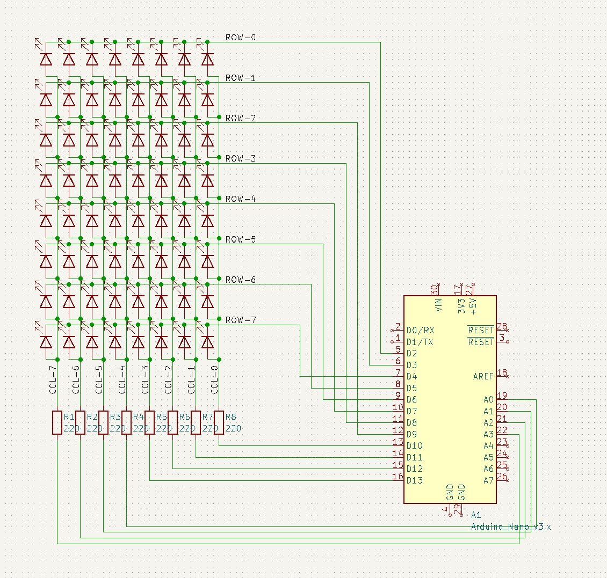
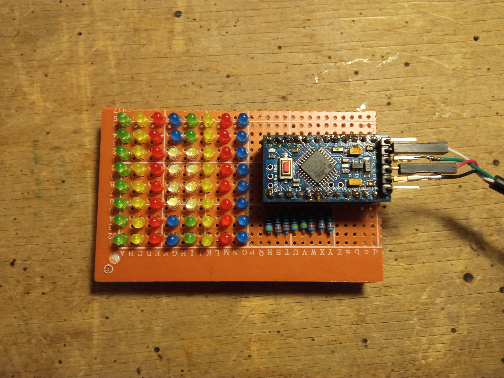

# led-matrix
Arduino code and a Angular Web app for driving a 8x8 LED Matrix.

You can see it in action [here](https://youtu.be/ep3m4p4XYZE).

# Software
An Angular Web App that uses the [Web Serial API](https://developer.mozilla.org/en-US/docs/Web/API/Web_Serial_API) to communicate with the Arduino.

It is hosted on [Github Pages](https://stopnoanime.github.io/led-matrix/) using a CI/CD Github Action.

## Folder structure
    .
    ├── arduino                 # Arduino PlatformIO project
    │   ├── schematic           # KiCad schematic
    │   └── ...
    ├── web-app                 # Angular project
    │   ├── cypress             # e2e tests
    │   └── ...
    └── ...

# Hardware
- Arduino Pro Mini
- USB to UART adapter
- 8x8 LED matrix
- 8x220Ω resistor

## Schematic

## Hand soldered board
 